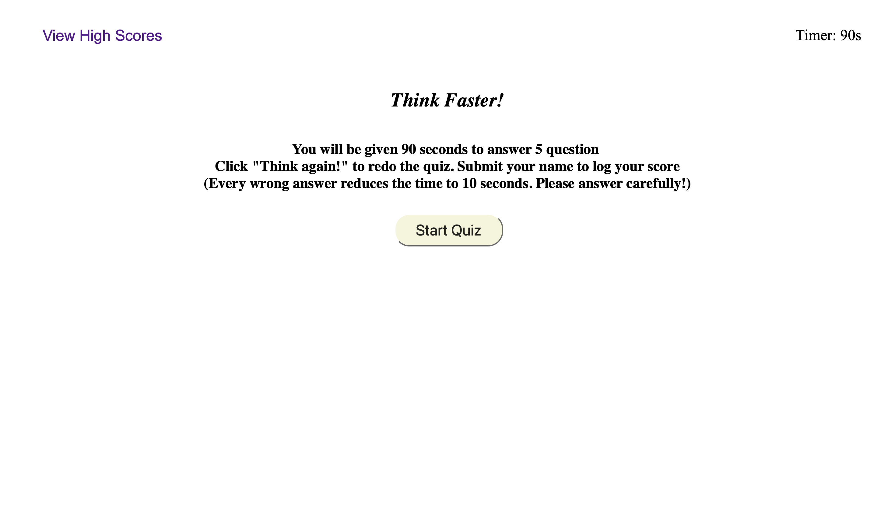
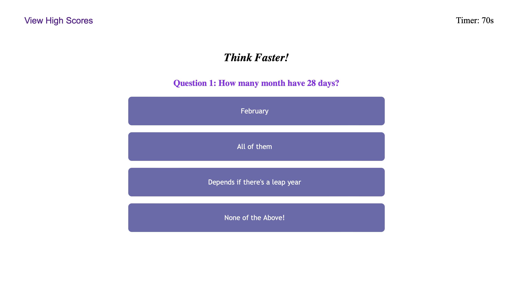

# Think Faster!

## Description

This website contains contains an instruction and series of questions to train our brain to think faster. This program contains a start button that when clicked, it will prompt user with series of questions. There are total of 5 questions and choosing an answer will tell the user if they got the answer wrong, which reduces their time limit to 10 each or correct answer and will give user 1500 points each. As the user chooses the answer, it will prompt the next. At the end of the last question, a score will be displayed and will be promted to record their name and their score, with options to "Think Again!" (Restart the quiz) or clear the scores which will both refresh the page to the instruction page and the button to start the quiz with the timer restarted. 

## Usage

This Think Faster! program that i created train our brain to think fast and added element and animation confirmation to make it more fun. Each questions are simple but very tricky if you dont read twice. although it can be very hard when its timed and losing more time when answer incorrectly but hey your pushing your brain to the limit 😁

## URL

https://junnel308.github.io/Think_Fast_Er/

## Screenshots

## Credits

Robert Wijtman (Instructor), AskBCS Learning Assistance, Bootcamp Modules, w3schools.com, stackoverflow.com, SweetAlert.

## License

MIT License

Copyright (c) 2022 JP Padilla

Permission is hereby granted, free of charge, to any person obtaining a copy
of this software and associated documentation files (the "Software"), to deal
in the Software without restriction, including without limitation the rights
to use, copy, modify, merge, publish, distribute, sublicense, and/or sell
copies of the Software, and to permit persons to whom the Software is
furnished to do so, subject to the following conditions:

The above copyright notice and this permission notice shall be included in all
copies or substantial portions of the Software.

THE SOFTWARE IS PROVIDED "AS IS", WITHOUT WARRANTY OF ANY KIND, EXPRESS OR
IMPLIED, INCLUDING BUT NOT LIMITED TO THE WARRANTIES OF MERCHANTABILITY,
FITNESS FOR A PARTICULAR PURPOSE AND NONINFRINGEMENT. IN NO EVENT SHALL THE
AUTHORS OR COPYRIGHT HOLDERS BE LIABLE FOR ANY CLAIM, DAMAGES OR OTHER
LIABILITY, WHETHER IN AN ACTION OF CONTRACT, TORT OR OTHERWISE, ARISING FROM,
OUT OF OR IN CONNECTION WITH THE SOFTWARE OR THE USE OR OTHER DEALINGS IN THE
SOFTWARE.
